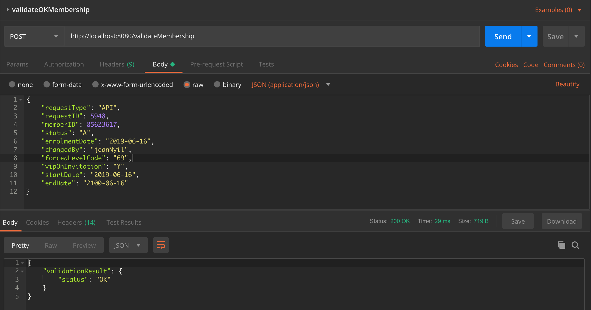
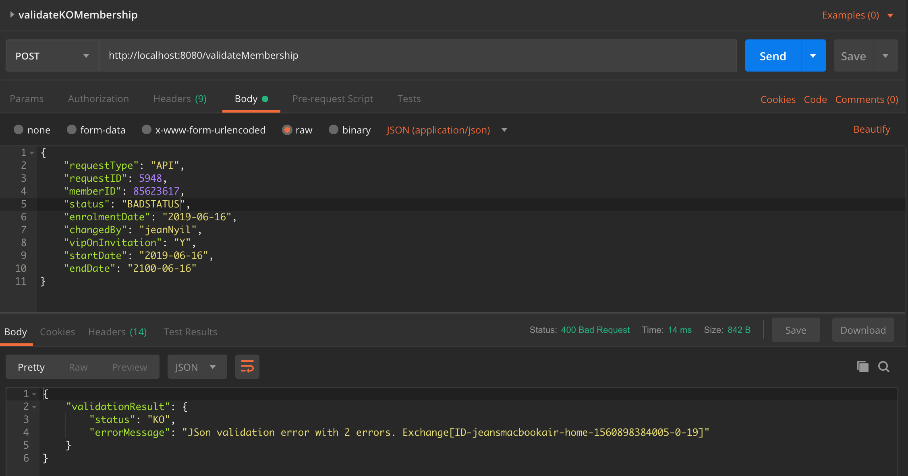

# Red Hat Fuse implementation of the _Sample JSON Validation API_

## API Description ##
Sample JSON Validation API implemented by following a contract-first approach.

## Build ##

```
mvn clean install
```

## Run locally ##

```
mvn clean spring-boot:run -Dfabric8.skip=true
```

## Deploy on OpenShift ##

**Prerequisite**: 
- A fully functional *OpenShift cluster* containing *Red Hat Fuse 7.3 imagestreams* is available and running.
- Please see the [Red Hat Fuse 7.3 on OpenShift Getting Started for Adminstrators](https://access.redhat.com/documentation/en-us/red_hat_fuse/7.3/html-single/fuse_on_openshift_guide/index#get-started-admin) for more details.

**Instructions**:
1. Update the [src/main/fabric8/route.yml](src/main/fabric8/route.yml) descriptor and adapt the route `host` according to your *OpenShift cluster*.
2. Run the *Fabric8 Maven Plugin* goal to deploy the Red Hat Fuse application onto your *OpenShift cluster*.

```
mvn clean fabric8:deploy
```

## Test ##

#### Locally ####

- Retrieve the OpenAPI document: `curl -vvvL http://localhost:8080/openapi.json`

```
$ curl -vvvL http://localhost:8080/openapi.json
*   Trying ::1...
* TCP_NODELAY set
* Connected to localhost (::1) port 8080 (#0)
> GET /openapi.json HTTP/1.1
> Host: localhost:8080
> User-Agent: curl/7.54.0
> Accept: */*
>
< HTTP/1.1 200 OK
< Accept: */*
< breadcrumbId: ID-jeansmacbookair-home-1560894409187-0-1
< Access-Control-Allow-Headers: Origin, Accept, X-Requested-With, Content-Type, Access-Control-Request-Method, Access-Control-Request-Headers
< User-Agent: curl/7.54.0
< Date: Tue, 18 Jun 2019 21:46:56 GMT
< Connection: keep-alive
< Access-Control-Allow-Origin: *
< Transfer-Encoding: chunked
< Content-Type: application/vnd.oai.openapi+json
< X-Application-Context: application:8080
< Access-Control-Allow-Methods: GET, HEAD, POST, PUT, DELETE, TRACE, OPTIONS, CONNECT, PATCH
< Access-Control-Max-Age: 3600
<
{
  "swagger" : "2.0",
  "info" : {
    "description" : "A simple API to test the Camel json-schema-validator component",
    "version" : "1.0",
    "title" : "Sample JSON Validation API",
    "contact" : {
      "name" : "Jean Nyilimbibi"
    },
    "license" : {
      "name" : "MIT License",
      "url" : "https://opensource.org/licenses/MIT"
    }
  },
  "tags" : [ {
    "name" : "RESTDSL"
  }, {
    "name" : "json-schema-validator",
    "description" : ""
  }, {
    "name" : "fuse7springboot",
    "description" : ""
  } ],
  "consumes" : [ "application/json" ],
  "produces" : [ "application/json" ],
  "paths" : {
    "/validateMembership" : {
      "post" : {
        "summary" : "Validate Membership",
        "description" : "Validates a `Membership` instance",
        "operationId" : "createMembership",
        "parameters" : [ {
          "in" : "body",
          "name" : "body",
          "description" : "A new `Membership` to be created.",
          "required" : true,
          "schema" : {
            "$ref" : "#/definitions/Membership"
          }
        } ],
        "responses" : {
          "200" : {
            "description" : "`Membership`JSON data validated",
            "schema" : {
              "$ref" : "#/definitions/ValidationResult"
            }
          },
          "400" : {
            "description" : "`Membership`JSON data not valid",
            "schema" : {
              "$ref" : "#/definitions/ValidationResult"
            }
          },
          "500" : {
            "description" : "Internal server error",
            "schema" : {
              "$ref" : "#/definitions/Error"
            }
          }
        }
      }
    }
  },
  "definitions" : {
    "Membership" : {
      "type" : "object",
      "required" : [ "changedBy", "endDate", "enrolmentDate", "memberID", "requestID", "requestType", "vipOnInvitation" ],
      "properties" : {
        "requestType" : {
          "type" : "string"
        },
        "requestID" : {
          "type" : "integer",
          "format" : "int32"
        },
        "memberID" : {
          "type" : "integer",
          "format" : "int32"
        },
        "status" : {
          "type" : "string",
          "minLength" : 1,
          "maxLength" : 1,
          "enum" : [ "A", "B", "C" ]
        },
        "enrolmentDate" : {
          "type" : "string",
          "format" : "date"
        },
        "changedBy" : {
          "type" : "string"
        },
        "forcedLevelCode" : {
          "type" : "string"
        },
        "vipOnInvitation" : {
          "type" : "string",
          "minLength" : 1,
          "maxLength" : 1,
          "enum" : [ "N", "Y" ]
        },
        "startDate" : {
          "type" : "string",
          "format" : "date"
        },
        "endDate" : {
          "type" : "string",
          "format" : "date"
        }
      },
      "title" : "Root Type for membership",
      "description" : "Membership data ",
      "example" : "{\n    \"requestType\": \"API\",\n    \"requestID\": 5948,\n    \"memberID\": 85623617,\n    \"status\": \"A\",\n    \"enrolmentDate\": \"2019-06-16\",\n    \"changedBy\": \"jeanNyil\",\n    \"forcedLevelCode\": null,\n    \"vipOnInvitation\": \"Y\",\n    \"startDate\": \"2019-06-16\",\n    \"endDate\": \"2100-06-16\"\n}"
    },
    "ValidationResult" : {
      "type" : "object",
      "properties" : {
        "validationResult" : {
          "type" : "object",
          "properties" : {
            "status" : {
              "type" : "string",
              "minLength" : 2,
              "maxLength" : 2,
              "enum" : [ "OK", "KO" ]
            },
            "errorMessage" : {
              "type" : "string"
            }
          }
        }
      },
      "title" : "Root Type for ValidationResult",
      "description" : "Validation Result   ",
      "example" : "{\n    \"validationResult\": {\n        \"status\": \"OK\",\n        \"errorMessage\": \"6 errors found\"\n    }\n}"
    },
    "Error" : {
      "type" : "object",
      "properties" : {
        "error" : {
          "type" : "object",
          "properties" : {
            "id" : {
              "type" : "string"
            },
            "description" : {
              "type" : "string"
            },
            "messages" : {
              "type" : "array",
              "items" : { }
            }
          }
        }
      },
      "title" : "Root Type for Error",
      "description" : "Error message structure",
      "example" : "{\n\t\"error\": {\n\t\t\"id\": \"500\",\n\t\t\"description\": \"Internal Server Error\",\n\t\t\"messages\": [\n\t\t\t\"java.lang.Exception: Mocked error message\"\n\t\t]\n\t}\n}"
    }
  }
* Connection #0 to host localhost left intact
}
```

- Using *[Postman](https://www.getpostman.com/products)*
  - You may import the embedded [tests Postman collection](./tests/Sample_JSON_Validation_API.postman_collection.json)
  - Screenshots samples of validation tests using *[Postman](https://www.getpostman.com/products)*



#### OpenShift ####

Same instructions as above but replace the `localhost:8080` with your *OpenShift route for the service*.

For example, `http://sample-json-validation-api.apps.69ac.example.opentlc.com/openapi.json` will return the OpenAPI document used to implement the service.