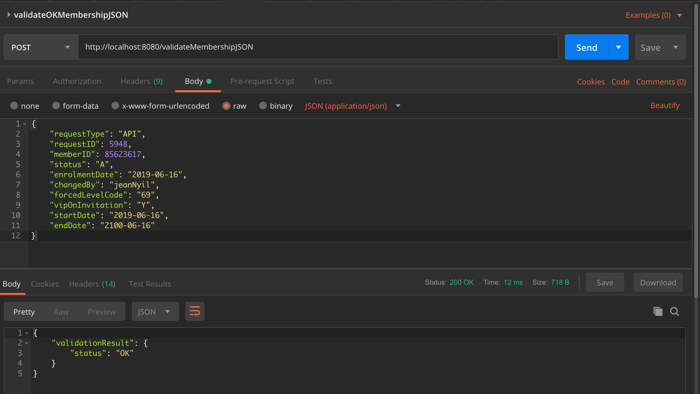
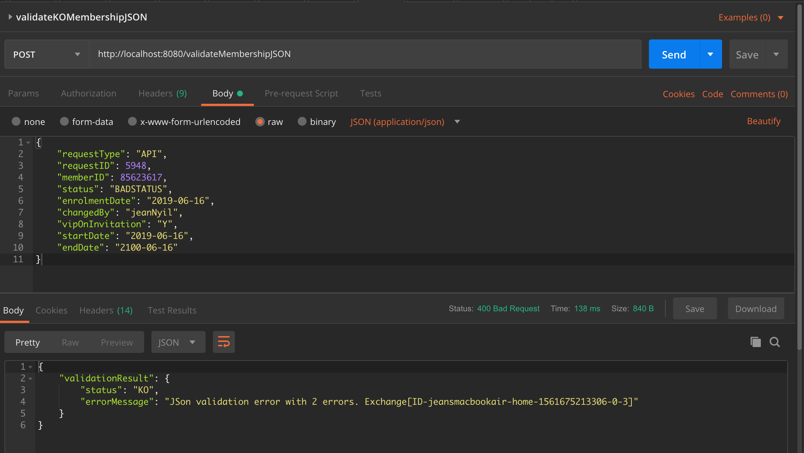

# Red Hat Fuse implementation of the _Sample JSON Validation API_

## API Description ##
Sample JSON Validation API implemented by following a contract-first approach.

## Build ##

**Prerequisite**: 
- Make sure [fuse-common-resources](../fuse-common-resources/README.md) module jar has already been built and installed in your local maven repository

**Run the following command to build the project**:

```
mvn clean package -Dfabric8.skip
```

## Run locally ##

```
mvn clean spring-boot:run -Dfabric8.skip
```

## Deploy on OpenShift ##

**Prerequisite**: 
- A fully functional *OpenShift cluster* containing *Red Hat Fuse 7.6 imagestreams* is available and running.
- Please see the [Red Hat Fuse 7.6 on OpenShift Getting Started for Adminstrators](https://access.redhat.com/documentation/en-us/red_hat_fuse/7.6/html-single/fuse_on_openshift_guide/index#get-started-admin) for more details.

**Instructions**:
1. Update the [src/main/fabric8/route.yml](src/main/fabric8/route.yml) descriptor and adapt the route `host` according to your *OpenShift cluster*.
2. Run the *Fabric8 Maven Plugin* goal to deploy the Red Hat Fuse application onto your *OpenShift cluster*.

```
mvn clean fabric8:deploy
```

## Test ##

#### Locally ####

- Retrieve the OpenAPI specification in JSON format: `curl http://localhost:8080/validateMembershipJSON/api-doc` or `curl http://localhost:8080/validateMembershipJSON/api-doc/swagger.json`

```
$ curl http://localhost:8080/validateMembershipJSON/api-doc
{
  "swagger" : "2.0",
  "info" : {
    "description" : "A simple API to test the Camel json-schema-validator component",
    "version" : "1.0.0",
    "title" : "Sample JSON Validation API",
    "contact" : {
      "name" : "Jean Nyilimbibi"
    },
    "license" : {
      "name" : "MIT License",
      "url" : "https://opensource.org/licenses/MIT"
    }
  },
  "host" : "0.0.0.0:8080",
  "basePath" : "/",
  "schemes" : [ "http" ],
  "paths" : {
    "/validateMembershipJSON" : {
      "post" : {
        "summary" : "Validates a `Membership` JSON instance",
        "operationId" : "sample-json-validation-restapi",
        "consumes" : [ "application/json" ],
        "produces" : [ "application/json" ],
        "parameters" : [ {
          "in" : "body",
          "name" : "body",
          "description" : "A `Membership` JSON instance to be validated.",
          "required" : true,
          "schema" : {
            "type" : "string"
          },
          "x-examples" : {
            "application/json" : "{\n    \"requestType\": \"API\",\n    \"requestID\": 5948,\n    \"memberID\": 85623617,\n    \"status\": \"A\",\n    \"enrolmentDate\": \"2019-06-16\",\n    \"changedBy\": \"jeanNyil\",\n    \"forcedLevelCode\": \"69\",\n    \"vipOnInvitation\": \"Y\",\n    \"startDate\": \"2019-06-16\",\n    \"endDate\": \"2100-06-16\"\n}"
          }
        } ],
        "responses" : {
          "200" : {
            "description" : "OK",
            "schema" : {
              "$ref" : "#/definitions/ValidationResult"
            },
            "examples" : {
              "application/json" : "{\n    \"validationResult\": {\n        \"status\": \"OK\"\n    }\n}"
            }
          },
          "400" : {
            "description" : "Bad Request",
            "schema" : {
              "$ref" : "#/definitions/ValidationResult"
            },
            "examples" : {
              "application/json" : "{\n    \"validationResult\": {\n        \"status\": \"KO\",\n        \"errorMessage\": \"6 errors found\"\n    }\n}"
            }
          },
          "500" : {
            "description" : "Internal Server Error",
            "schema" : {
              "$ref" : "#/definitions/ErrorResponse"
            },
            "examples" : {
              "application/json" : "{\n \"error\": {\n  \"id\": \"500\",\n  \"description\": \"Internal Server Error\",\n  \"messages\": [\n   \"java.lang.Exception: Mocked error message\"\n  ]\n }\n}"
            }
          }
        }
      }
    }
  },
  "definitions" : {
    "ValidationResult_" : {
      "type" : "object",
      "properties" : {
        "status" : {
          "type" : "string"
        },
        "errorMessage" : {
          "type" : "string"
        }
      }
    },
    "ValidationResult" : {
      "type" : "object",
      "properties" : {
        "validationResult" : {
          "$ref" : "#/definitions/ValidationResult_"
        }
      }
    },
    "Error" : {
      "type" : "object",
      "properties" : {
        "id" : {
          "type" : "string"
        },
        "description" : {
          "type" : "string"
        },
        "messages" : {
          "type" : "array",
          "items" : {
            "type" : "string"
          }
        }
      }
    },
    "ErrorResponse" : {
      "type" : "object",
      "properties" : {
        "error" : {
          "$ref" : "#/definitions/Error"
        }
      }
    }
  }
}
```
- Retrieve the OpenAPI specification in YAML format: `curl http://localhost:8080/validateMembershipJSON/api-doc/swagger.yaml`

```
$ curl http://localhost:8080/validateMembershipJSON/api-doc/swagger.yaml
---
swagger: "2.0"
info:
  description: "A simple API to test the Camel json-schema-validator component"
  version: "1.0.0"
  title: "Sample JSON Validation API"
  contact:
    name: "Jean Nyilimbibi"
  license:
    name: "MIT License"
    url: "https://opensource.org/licenses/MIT"
host: "0.0.0.0:8080"
basePath: "/"
schemes:
- "http"
paths:
  /validateMembershipJSON:
    post:
      summary: "Validates a `Membership` JSON instance"
      operationId: "sample-json-validation-restapi"
      consumes:
      - "application/json"
      produces:
      - "application/json"
      parameters:
      - in: "body"
        name: "body"
        description: "A `Membership` JSON instance to be validated."
        required: true
        schema:
          type: "string"
        x-examples:
          application/json: "{\n    \"requestType\": \"API\",\n    \"requestID\":\
            \ 5948,\n    \"memberID\": 85623617,\n    \"status\": \"A\",\n    \"enrolmentDate\"\
            : \"2019-06-16\",\n    \"changedBy\": \"jeanNyil\",\n    \"forcedLevelCode\"\
            : \"69\",\n    \"vipOnInvitation\": \"Y\",\n    \"startDate\": \"2019-06-16\"\
            ,\n    \"endDate\": \"2100-06-16\"\n}"
      responses:
        200:
          description: "OK"
          schema:
            $ref: "#/definitions/ValidationResult"
          examples:
            application/json: "{\n    \"validationResult\": {\n        \"status\"\
              : \"OK\"\n    }\n}"
        400:
          description: "Bad Request"
          schema:
            $ref: "#/definitions/ValidationResult"
          examples:
            application/json: "{\n    \"validationResult\": {\n        \"status\"\
              : \"KO\",\n        \"errorMessage\": \"6 errors found\"\n    }\n}"
        500:
          description: "Internal Server Error"
          schema:
            $ref: "#/definitions/ErrorResponse"
          examples:
            application/json: "{\n \"error\": {\n  \"id\": \"500\",\n  \"description\"\
              : \"Internal Server Error\",\n  \"messages\": [\n   \"java.lang.Exception:\
              \ Mocked error message\"\n  ]\n }\n}"
definitions:
  ValidationResult_:
    type: "object"
    properties:
      status:
        type: "string"
      errorMessage:
        type: "string"
  ValidationResult:
    type: "object"
    properties:
      validationResult:
        $ref: "#/definitions/ValidationResult_"
  Error:
    type: "object"
    properties:
      id:
        type: "string"
      description:
        type: "string"
      messages:
        type: "array"
        items:
          type: "string"
  ErrorResponse:
    type: "object"
    properties:
      error:
        $ref: "#/definitions/Error"
```

- Using *[Postman](https://www.getpostman.com/products)*
  - You may import the embedded [tests Postman collection](./tests/Sample_JSON_Validation_API.postman_collection.json)
  - Screenshots samples of validation tests using *[Postman](https://www.getpostman.com/products)*



#### OpenShift ####

Same instructions as above but replace the `localhost:8080` with your *OpenShift route for the service*.

For example, `http://sample-json-validation-api.apps.cluster-4e2c.sandbox1596.opentlc.com/validateMembershipJSON/api-doc/swagger.yaml` will return the OpenAPI specification of the service in YAML format.