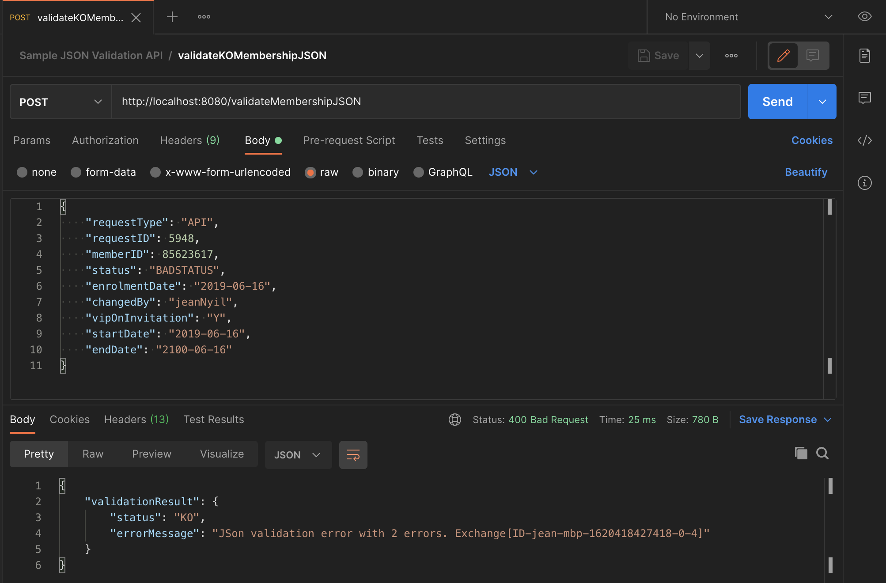
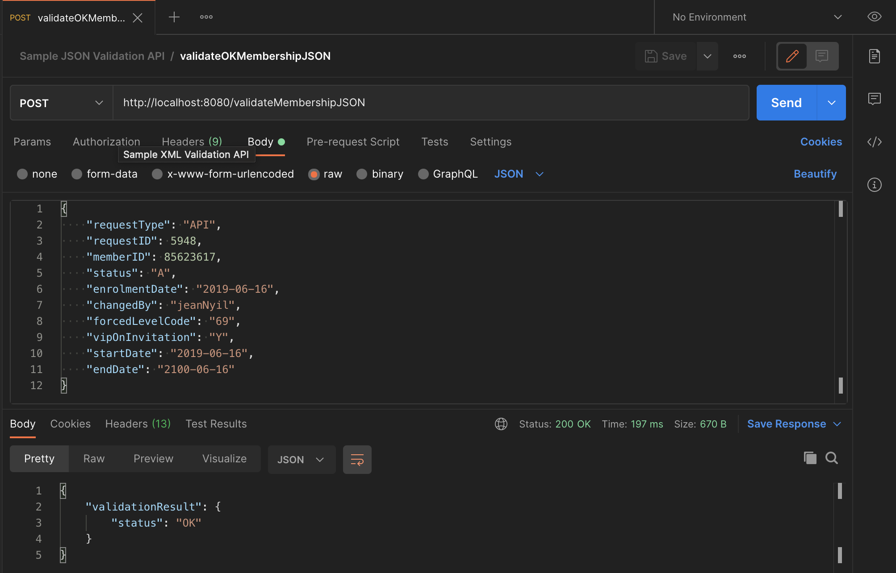

# Red Hat Fuse implementation of the _Sample JSON Validation API_

## API Description ##
Sample JSON Validation API implemented by following a contract-first approach.

## Build ##

**Prerequisite**: 
- Make sure [fuse-common-resources](../fuse-common-resources/README.md) module jar has already been built and installed in your local maven repository

**Run the following command to build the project**:

```
mvn clean package -Dfabric8.skip
```

## Run locally ##

```
mvn clean spring-boot:run -Dfabric8.skip
```

## Deploy on OpenShift ##

**Prerequisite**: 
- A fully functional *OpenShift cluster* containing *Red Hat Fuse 7.4 imagestreams* is available and running.
- Please see the [Red Hat Fuse 7.4 on OpenShift Getting Started for Adminstrators](https://access.redhat.com/documentation/en-us/red_hat_fuse/7.4/html-single/fuse_on_openshift_guide/index#get-started-admin) for more details.

**Instructions**:
1. Update the [src/main/fabric8/route.yml](src/main/fabric8/route.yml) descriptor and adapt the route `host` according to your *OpenShift cluster*.
2. Run the *Fabric8 Maven Plugin* goal to deploy the Red Hat Fuse application onto your *OpenShift cluster*.

```
mvn clean fabric8:deploy
```

## Test ##

#### Locally ####

- Retrieve the OpenAPI document: `curl http://localhost:8080/validateMembershipJSON/openapi.json`

```
$ curl http://localhost:8080/validateMembershipJSON/openapi.json
{
    "swagger": "2.0",
    "info": {
        "title": "Sample JSON Validation API",
        "description": "A simple API to test the Camel json-schema-validator component",
        "contact": {
            "name": "Jean Nyilimbibi"
        },
        "license": {
            "name": "MIT License",
            "url": "https://opensource.org/licenses/MIT"
        },
        "version": "1.0.0"
    },
    "consumes": [
        "application/json"
    ],
    "produces": [
        "application/json"
    ],
    "paths": {
        "/validateMembershipJSON": {
            "post": {
                "summary": "Validate Membership JSON instance",
                "description": "Validates a `Membership` JSON instance",
                "operationId": "validateMembershipJSON",
                "parameters": [
                    {
                        "name": "body",
                        "in": "body",
                        "description": "A `Membership` JSON instance to be validated.",
                        "required": true,
                        "schema": {
                            "$ref": "#/definitions/Membership"
                        }
                    }
                ],
                "responses": {
                    "200": {
                        "description": "`Membership`JSON data validated",
                        "schema": {
                            "$ref": "#/definitions/ValidationResult"
                        }
                    },
                    "400": {
                        "description": "`Membership`JSON data not valid",
                        "schema": {
                            "$ref": "#/definitions/ValidationResult"
                        }
                    },
                    "500": {
                        "description": "Internal server error",
                        "schema": {
                            "$ref": "#/definitions/Error"
                        }
                    }
                }
            }
        }
    },
    "definitions": {
        "Membership": {
            "title": "Root Type for membership",
            "description": "Membership data ",
            "required": [
                "changedBy",
                "endDate",
                "enrolmentDate",
                "memberID",
                "requestID",
                "requestType",
                "vipOnInvitation"
            ],
            "type": "object",
            "properties": {
                "requestType": {
                    "type": "string"
                },
                "requestID": {
                    "format": "int32",
                    "type": "integer"
                },
                "memberID": {
                    "format": "int32",
                    "type": "integer"
                },
                "status": {
                    "maxLength": 1,
                    "minLength": 1,
                    "enum": [
                        "A",
                        "B",
                        "C"
                    ],
                    "type": "string"
                },
                "enrolmentDate": {
                    "format": "date",
                    "type": "string"
                },
                "changedBy": {
                    "type": "string"
                },
                "forcedLevelCode": {
                    "type": "string"
                },
                "vipOnInvitation": {
                    "maxLength": 1,
                    "minLength": 1,
                    "enum": [
                        "N",
                        "Y"
                    ],
                    "type": "string"
                },
                "startDate": {
                    "format": "date",
                    "type": "string"
                },
                "endDate": {
                    "format": "date",
                    "type": "string"
                }
            },
            "example": "{\n    \"requestType\": \"API\",\n    \"requestID\": 5948,\n    \"memberID\": 85623617,\n    \"status\": \"A\",\n    \"enrolmentDate\": \"2019-06-16\",\n    \"changedBy\": \"jeanNyil\",\n    \"forcedLevelCode\": \"69\",\n    \"vipOnInvitation\": \"Y\",\n    \"startDate\": \"2019-06-16\",\n    \"endDate\": \"2100-06-16\"\n}"
        },
        "ValidationResult": {
            "title": "Root Type for ValidationResult",
            "description": "Validation Result   ",
            "type": "object",
            "properties": {
                "validationResult": {
                    "type": "object",
                    "properties": {
                        "status": {
                            "maxLength": 2,
                            "minLength": 2,
                            "enum": [
                                "OK",
                                "KO"
                            ],
                            "type": "string"
                        },
                        "errorMessage": {
                            "type": "string"
                        }
                    }
                }
            },
            "example": "{\n    \"validationResult\": {\n        \"status\": \"KO\",\n        \"errorMessage\": \"6 errors found\"\n    }\n}"
        },
        "Error": {
            "title": "Root Type for Error",
            "description": "Error message structure",
            "type": "object",
            "properties": {
                "error": {
                    "type": "object",
                    "properties": {
                        "id": {
                            "type": "string"
                        },
                        "description": {
                            "type": "string"
                        },
                        "messages": {
                            "type": "array",
                            "items": {}
                        }
                    }
                }
            },
            "example": "{\n\t\"error\": {\n\t\t\"id\": \"500\",\n\t\t\"description\": \"Internal Server Error\",\n\t\t\"messages\": [\n\t\t\t\"java.lang.Exception: Mocked error message\"\n\t\t]\n\t}\n}"
        }
    },
    "tags": [
        {
            "name": "RESTDSL"
        },
        {
            "name": "json-schema-validator"
        },
        {
            "name": "fuse7springboot"
        }
    ]
}
```

- Using *[Postman](https://www.getpostman.com/products)*
  - You may import the embedded [tests Postman collection](./tests/Sample_JSON_Validation_API.postman_collection.json)
  - Screenshots samples of validation tests using *[Postman](https://www.getpostman.com/products)*



#### OpenShift ####

Same instructions as above but replace the `localhost:8080` with your *OpenShift route for the service*.

For example, `http://sample-json-validation-api.apps.69ac.example.opentlc.com/validateMembershipJSON/openapi.json` will return the OpenAPI document used to implement the service.