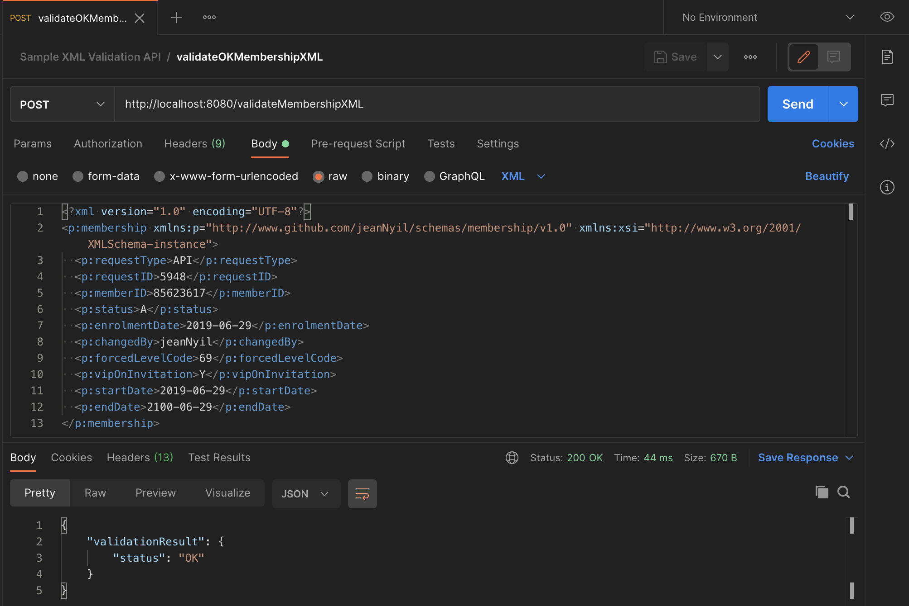
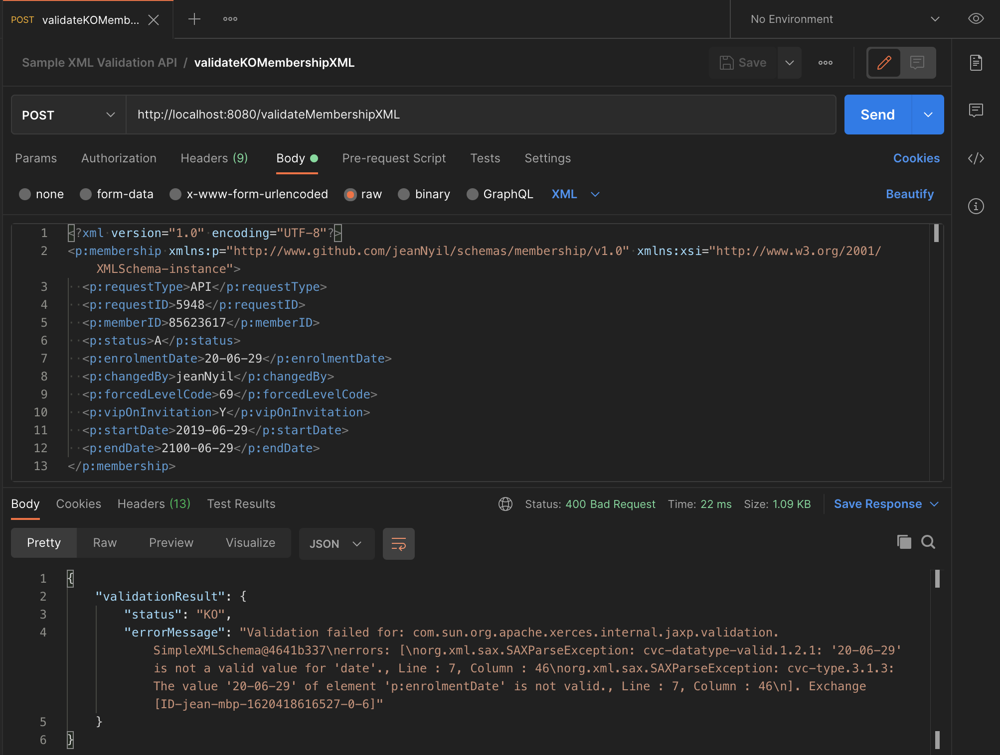

# Red Hat Fuse implementation of the _Sample XML Validation API_

## API Description ##
Sample XML Validation API implemented by following a contract-first approach.

## Build ##

**Prerequisite**: 
- Make sure [fuse-common-resources](../fuse-common-resources/README.md) module jar has already been built and installed in your local maven repository

**Run the following command to build the project using JDK 11**:

```zsh
mvn clean package -Pjava11 -Djkube.skip
```

## Run locally ##

```zsh
mvn spring-boot:run -Pjava11 -Djkube.skip
```

## Deploy on OpenShift ##

**Prerequisite**: 
- A fully functional *OpenShift cluster* containing *Red Hat Fuse 7.9 imagestreams* is available and running.
- Please see the [Red Hat Fuse 7.9 on OpenShift Getting Started for Adminstrators](https://access.redhat.com/documentation/en-us/red_hat_fuse/7.9/html-single/fuse_on_openshift_guide/index#get-started-admin) for more details.

**Instructions**:
1. Update the [src/main/jkube/route.yml](src/main/jkube/route.yml) descriptor and adapt the route `host` according to your *OpenShift cluster*.
2. Run the [*Eclipse Jkube OpenShift Maven Plugin*](https://www.eclipse.org/jkube/docs/openshift-maven-plugin) goal to deploy the Red Hat Fuse application onto your *OpenShift cluster*.

```zsh
mvn clean oc:deploy -Pjava11
```

## Test ##

#### Locally ####

- Retrieve the OpenAPI specification in JSON format: `curl -H 'Accept: application/json' http://localhost:8080/openapi.json`

```zsh
$ curl -H 'Accept: application/json' http://localhost:8080/openapi.json
```
```json
{
    "openapi": "3.0.2",
    "info": {
        "title": "Sample XML Validation API",
        "version": "1.0.0",
        "description": "A simple API to test the Camel XML validator component",
        "contact": {
            "name": "Jean Nyilimbibi"
        },
        "license": {
            "name": "MIT License",
            "url": "https://opensource.org/licenses/MIT"
        }
    },
    "servers": [
        {
            "url": "https://xml-validation-api.apps.jeannyil.sandbox706.opentlc.com"
        }
    ],
    "paths": {
        "/validateMembershipXML": {
            "post": {
                "requestBody": {
                    "description": "A `Membership` XML instance to be validated.",
                    "content": {
                        "text/xml": {
                            "schema": {
                                "type": "string"
                            },
                            "examples": {
                                "Membership": {
                                    "value": "<?xml version=\"1.0\" encoding=\"UTF-8\"?>\n<p:membership xmlns:p=\"http://www.github.com/jeanNyil/schemas/membership/v1.0\" xmlns:xsi=\"http://www.w3.org/2001/XMLSchema-instance\">\n  <p:requestType>API</p:requestType>\n  <p:requestID>5948</p:requestID>\n  <p:memberID>85623617</p:memberID>\n  <p:status>A</p:status>\n  <p:enrolmentDate>2019-06-29</p:enrolmentDate>\n  <p:changedBy>jeanNyil</p:changedBy>\n  <p:forcedLevelCode>69</p:forcedLevelCode>\n  <p:vipOnInvitation>Y</p:vipOnInvitation>\n  <p:startDate>2019-06-29</p:startDate>\n  <p:endDate>2100-06-29</p:endDate>\n</p:membership>"
                                }
                            }
                        }
                    },
                    "required": true
                },
                "responses": {
                    "200": {
                        "content": {
                            "application/json": {
                                "schema": {
                                    "$ref": "#/components/schemas/ValidationResult"
                                },
                                "examples": {
                                    "validationResult_200": {
                                        "value": {
                                            "validationResult": {
                                                "status": "OK"
                                            }
                                        }
                                    }
                                }
                            }
                        },
                        "description": "`Membership` XML data validated"
                    },
                    "400": {
                        "content": {
                            "application/json": {
                                "schema": {
                                    "$ref": "#/components/schemas/ValidationResult"
                                },
                                "examples": {
                                    "validationResult_400": {
                                        "value": {
                                            "validationResult": {
                                                "status": "KO",
                                                "errorMessage": "Validation failed for: com.sun.org.apache.xerces.internal.jaxp.validation.SimpleXMLSchema@493de94f\nerrors: [\norg.xml.sax.SAXParseException: cvc-datatype-valid.1.2.1: '20-06-29' is not a valid value for 'date'., Line : 7, Column : 46\norg.xml.sax.SAXParseException: cvc-type.3.1.3: The value '20-06-29' of element 'p:enrolmentDate' is not valid., Line : 7, Column : 46\n]. Exchange[ID-sample-xml-validation-api-1-2gh7r-1620389968693-0-4]"
                                            }
                                        }
                                    }
                                }
                            }
                        },
                        "description": "`Membership` XML data not valid"
                    },
                    "500": {
                        "content": {
                            "application/json": {
                                "schema": {
                                    "$ref": "#/components/schemas/Error"
                                },
                                "examples": {
                                    "error_500": {
                                        "value": {
                                            "error": {
                                                "id": "500",
                                                "description": "Internal Server Error",
                                                "messages": [
                                                    "java.lang.Exception: Mocked error message"
                                                ]
                                            }
                                        }
                                    }
                                }
                            }
                        },
                        "description": "Internal server error"
                    }
                },
                "operationId": "validateMembershipXML",
                "summary": "Validate Membership XML instance",
                "description": "Validates a `Membership` instance",
                "x-codegen-request-body-name": "body"
            }
        }
    },
    "components": {
        "schemas": {
            "ValidationResult": {
                "description": "Validation Result   ",
                "type": "object",
                "properties": {
                    "validationResult": {
                        "type": "object",
                        "properties": {
                            "status": {
                                "maxLength": 2,
                                "minLength": 2,
                                "enum": [
                                    "OK",
                                    "KO"
                                ],
                                "type": "string"
                            },
                            "errorMessage": {
                                "type": "string"
                            }
                        }
                    }
                },
                "example": "{\n\t\"validationResult\": {\n\t\t\"status\": \"KO\",\n\t\t\"errorMessage\": \"Validation failed for: com.sun.org.apache.xerces.internal.jaxp.validation.SimpleXMLSchema@5f86796e\\nerrors: [\\norg.xml.sax.SAXParseException: cvc-datatype-valid.1.2.1: '20-06-29' is not a valid value for 'date'., Line : 7, Column : 46\\norg.xml.sax.SAXParseException: cvc-type.3.1.3: The value '20-06-29' of element 'p:enrolmentDate' is not valid., Line : 7, Column : 46\\n]. Exchange[ID-jeansmacbookair-home-1561803539861-1-1]\"\n\t}\n}"
            },
            "Error": {
                "description": "Error message structure",
                "type": "object",
                "properties": {
                    "error": {
                        "type": "object",
                        "properties": {
                            "id": {
                                "type": "string"
                            },
                            "description": {
                                "type": "string"
                            },
                            "messages": {
                                "type": "array",
                                "items": {
                                    "type": "object"
                                }
                            }
                        }
                    }
                },
                "example": "{\n\t\"error\": {\n\t\t\"id\": \"500\",\n\t\t\"description\": \"Internal Server Error\",\n\t\t\"messages\": [\n\t\t\t\"java.lang.Exception: Mocked error message\"\n\t\t]\n\t}\n}"
            }
        }
    }
}
```

- Using *[Postman](https://www.getpostman.com/products)*
  - You may import the embedded [tests Postman collection](./tests/Sample_XML_Validation_API.postman_collection.json)
  - Screenshots samples of validation tests using *[Postman](https://www.getpostman.com/products)*



#### OpenShift ####

Same instructions as above but replace the `localhost:8080` with your *OpenShift route for the service*.

For example, `http://sample-xml-validation-api.apps.jeannyil.sandbox706.opentlc.com/openapi.json` will return the OpenAPI specification of the service.